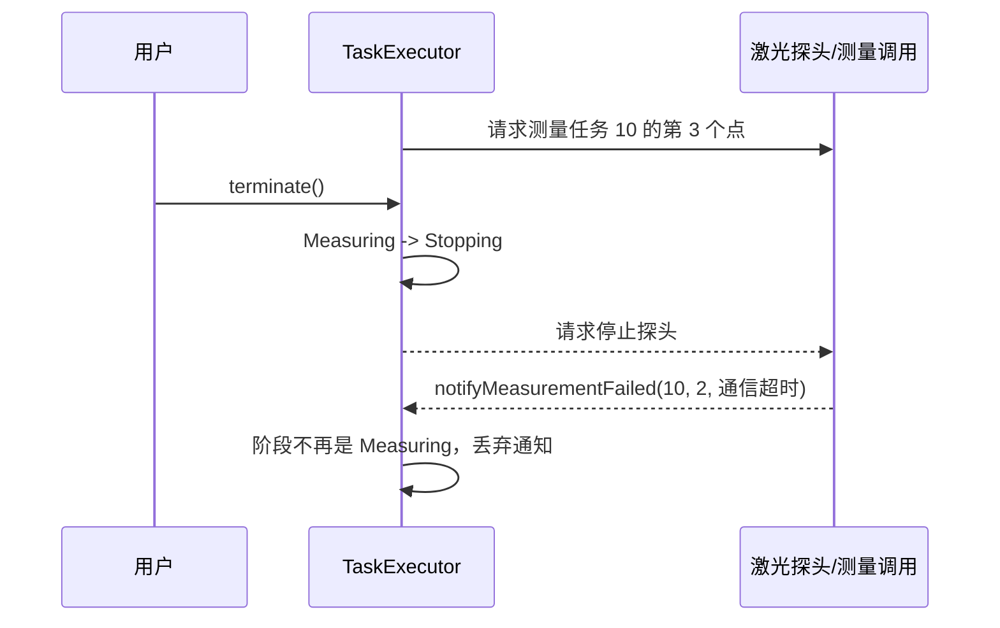

# 任务回调的阶段与身份校验

## 1. 说明目的

`TaskExecutor` 在处理运动和测量结果通知时，会同时检查任务执行阶段、执行编号和测量点索引。例如：

```cpp
void TaskExecutor::notifyMeasurementFailed(
    quint64 executionId,
    int pointIndex,
    const QString& reason)
{
    if (phase_ != ExecutionPhase::Measuring
        || !matchesCurrentPoint(executionId, pointIndex)) {
        return;
    }
    beginStopping(
        TaskResult::Failed,
        QStringLiteral("第 %1 个目标测量失败：%2").arg(pointIndex + 1).arg(reason));
}
```

这些条件不是重复判断。它们分别确认通知到达时，状态机仍在等待对应类型、对应任务、对应测量点的结果。

本文描述的是当前代码中的防护逻辑。文中的异步时序示例也适用于设备调用以后改为异步、排队信号或跨线程处理的情况。

## 2. 三个校验维度

### 2.1 执行阶段 `phase_`

执行阶段表示状态机当前正在等待哪一类结果：

| 当前阶段 | 可以推进流程的通知 |
| --- | --- |
| `Moving` | 当前点的运动完成或运动失败通知 |
| `Measuring` | 当前点的测量完成或测量失败通知 |
| `Stopping` | 当前任务的运动停止和探头停止确认 |
| `Idle` | 不应接受运动、测量或停止结果通知 |
| `Faulted` | 不应通过普通结果通知继续推进任务 |

因此，`notifyMeasurementFailed()` 只在 `Measuring` 阶段处理失败。即使通知中的任务编号和点索引正确，只要执行器已经进入 `Stopping`、`Idle` 或其他阶段，该通知也不能再改变任务流程。

### 2.2 执行编号 `executionId`

每次 `start()` 接受新任务时，`TaskExecutor` 都会递增 `executionId_`。它用于区分先后两次任务。

例如，任务 10 已经结束，任务 11 正在执行。此时任务 10 的设备结果延迟到达：

```text
回调携带 executionId = 10
当前 executionId_ = 11
```

即使两个任务恰好都在处理第一个点，也必须丢弃任务 10 的旧结果，防止它推进或终止任务 11。

### 2.3 测量点索引 `pointIndex`

同一个任务会依次执行多个测量点。`pointIndex` 用于确认结果属于当前正在处理的点。

例如，第 2 个点已经测量完成，状态机开始移动到第 3 个点。此时第 2 个点的重复结果到达：

```text
回调携带 pointIndex = 1
当前 currentPointIndex_ = 2
```

即使 `executionId` 相同，也必须丢弃这个旧点结果，否则可能重复记录数据、跳过测量点或错误终止整个任务。

`matchesCurrentPoint()` 只负责后两个维度：

```cpp
bool TaskExecutor::matchesCurrentPoint(quint64 executionId, int pointIndex) const
{
    return executionId == executionId_
        && pointIndex == currentPointIndex_;
}
```

所以调用方还必须单独检查 `phase_`。

## 3. 什么是过期回调

这里的“过期”不是指超过固定时间，而是指：

> 回调到达时，状态机已经不再等待它所表达的结果。

回调中的数据可能仍然来自真实设备，也可能携带正确的执行编号和测量点索引，但当前状态已经发生变化，因此它不能再用于推进流程。

## 4. 测量失败回调的典型时序

假设任务正在测量第 3 个点：

```text
phase_             = Measuring
executionId_       = 10
currentPointIndex_ = 2
```

随后发生以下过程：



进入 `Stopping` 后，`executionId_` 和 `currentPointIndex_` 并不会立即改变，所以：

```cpp
matchesCurrentPoint(10, 2) == true
```

但测量失败通知已经过期，因为执行器不再等待测量结果，而是在等待设备停止确认。此时正是 `phase_ != ExecutionPhase::Measuring` 阻止了错误处理。

## 5. 如果没有阶段判断会怎样

如果 `notifyMeasurementFailed()` 只检查 `matchesCurrentPoint()`，上述过期通知会再次调用：

```cpp
beginStopping(TaskResult::Failed, detail);
```

而 `beginStopping()` 会执行以下操作：

```cpp
pendingStopResult_ = result;
pendingStopDetail_ = detail;
motionStopped_ = false;
probeStopped_ = false;
setPhase(ExecutionPhase::Stopping, ...);
emit motionStopRequested(executionId_);
emit probeStopRequested(executionId_);
```

由此可能产生：

1. 原本的“用户终止”结果被后到的测量失败覆盖，任务从 `Terminated` 变成 `Failed`。
2. 已经收到的运动或探头停止确认被重新置为 `false`。
3. 运动设备和探头收到重复停止请求。
4. 停止流程重新等待确认，造成结束时序混乱，严重时可能无法正常收尾。

因此，阶段判断不仅是在验证枚举值，也是为了保护停止结果、停止确认和任务终态不被迟到通知改写。

## 6. 当前通知的统一接收规则

当前实现采用相同模式处理各类通知：

| 通知入口 | 必须处于的阶段 | 身份校验 |
| --- | --- | --- |
| `notifyMotionCompleted()` | `Moving` | 当前 `executionId + pointIndex` |
| `notifyMotionFailed()` | `Moving` | 当前 `executionId + pointIndex` |
| `notifyMeasurementCompleted()` | `Measuring` | 当前 `executionId + pointIndex` |
| `notifyMeasurementFailed()` | `Measuring` | 当前 `executionId + pointIndex` |
| `notifyMotionStopped()` | `Stopping` | 当前 `executionId` |
| `notifyProbeStopped()` | `Stopping` | 当前 `executionId` |

可以把接收条件概括为：

```text
通知有效
    = 通知类型符合当前阶段
    && 通知属于当前任务
    && 涉及测量点时属于当前点
```

任意一项不满足，通知都会被忽略，状态机保持不变。

## 7. 当前同步实现与保留防护的原因

当前 `MeasurementTaskController::measurePoint()` 调用 `measureLaserOnce()` 后，会在同一处理流程内调用 `notifyMeasurementCompleted()` 或 `notifyMeasurementFailed()`。从当前连接方式和代码路径看，典型的单次测量反馈主要是同步处理。

即便如此，保留完整校验仍有价值：

- `notify...()` 是公开槽函数，正确性不应依赖某个调用方永远同步调用。
- 运动到位由定时器轮询产生，本身存在事件排队和任务状态先后变化的可能。
- 用户终止、设备故障和安全条件变化都可能使状态机提前进入停止流程。
- 以后将设备采集改为异步、工作线程或队列连接时，这些校验仍能直接保护状态机。
- 重复通知和调用顺序错误会被限制在入口处，不会扩散到任务结果和设备停止逻辑。

## 8. 结论

`phase_`、`executionId` 和 `pointIndex` 分别回答三个不同的问题：

| 校验信息 | 回答的问题 |
| --- | --- |
| `phase_` | 现在还在等待这种通知吗？ |
| `executionId` | 这是当前这一次任务的通知吗？ |
| `pointIndex` | 这是当前这个测量点的通知吗？ |

三者共同构成任务状态机的回调接收边界。`matchesCurrentPoint()` 不能替代阶段判断，因为任务进入 `Stopping` 后，执行编号和点索引可能仍然保持不变；只有阶段能够表达“这个结果现在是否仍然有效”。

## 9. 当前代码依据

- `src/workflow/task_executor.h`：`ExecutionPhase`、通知槽函数和执行器状态字段定义。
- `src/workflow/task_executor.cpp`：阶段转换、`matchesCurrentPoint()`、通知入口校验和 `beginStopping()`。
- `src/workflow/measurement_task_controller.cpp`：运动到位轮询、单次测量、终止设备和通知执行器的调用路径。

本文为静态代码分析，没有通过自动化测试、模拟器或真实设备验证异步时序。
