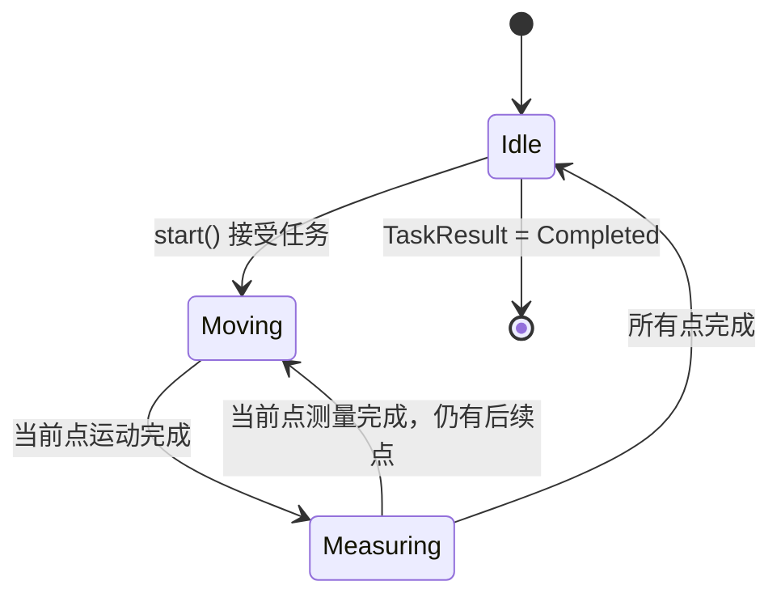
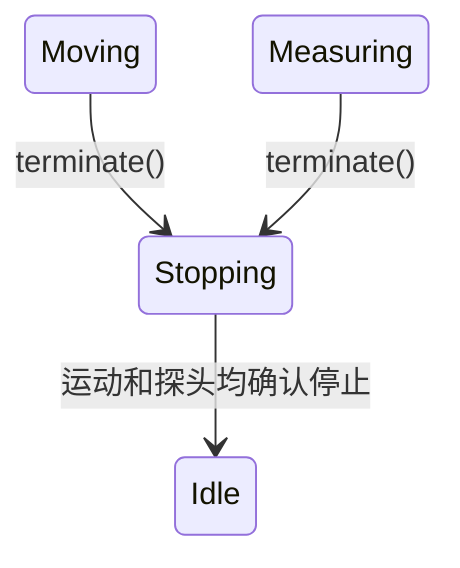
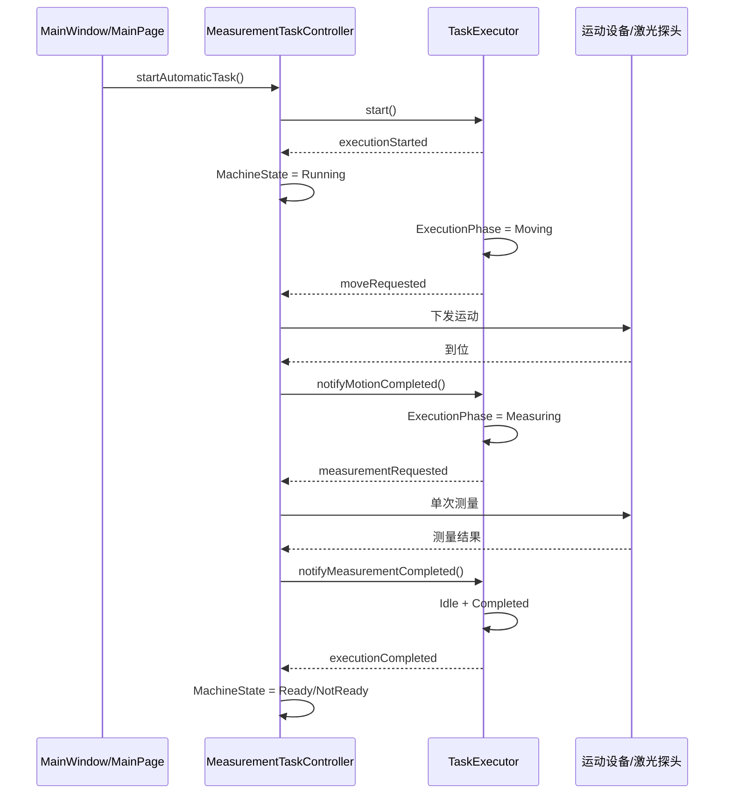

# 设备状态与任务执行阶段分析

## 1. 分析目的

项目当前同时维护以下两类状态：

- 设备状态：`otms::workflow::MachineState`，由 `MeasurementTaskController` 维护。
- 任务执行状态：`TaskExecutor::ExecutionPhase` 和 `TaskExecutor::TaskResult`，由 `TaskExecutor` 维护。

本文基于当前代码分析这些状态如何产生、如何被消费、两者如何联动，以及任务执行阶段是否有必要继续保留。

本文描述的是当前实现。文末的“结论与建议”属于基于现状得出的设计建议，不代表项目已经完成相应调整。

## 2. 状态定义与职责

### 2.1 设备状态 `MachineState`

定义位置：`src/workflow/machine_state.h`。

```cpp
enum class MachineState
{
    NotReady,
    Ready,
    Running,
    Fault
};
```

设备状态表达整机当前是否具备操作条件，以及是否允许下发运动或任务指令：

| 状态 | 当前含义 |
| --- | --- |
| `NotReady` | 启动条件没有全部满足，不能开始运动或自动任务。 |
| `Ready` | 数据库、运动设备、探头及安全联锁均满足条件，可以接受操作。 |
| `Running` | 整机正在执行手动运动或自动测量任务。 |
| `Fault` | 设备、控制、安全条件或执行过程发生故障，需要完成停止和故障复位。 |

`RunMode` 与设备状态定义在同一文件中，但它表达的是操作方式，而不是运行阶段：

```cpp
enum class RunMode
{
    Manual,
    Automatic
};
```

### 2.2 任务执行阶段 `ExecutionPhase`

定义位置：`src/workflow/task_executor.h`。

```cpp
enum class ExecutionPhase
{
    Idle,
    Moving,
    Measuring,
    Stopping,
    Faulted
};
```

任务执行阶段表达自动任务当前走到哪一步：

| 阶段 | 当前含义 |
| --- | --- |
| `Idle` | 没有正在执行的自动任务。 |
| `Moving` | 正在移动到当前测量点。 |
| `Measuring` | 当前测量点已经到位，正在采集测量值。 |
| `Stopping` | 任务正在终止，等待运动设备和探头分别确认停止。 |
| `Faulted` | 执行过程中设备就绪条件丢失，执行器进入故障状态。 |

### 2.3 任务结果 `TaskResult`

```cpp
enum class TaskResult
{
    None,
    Completed,
    Terminated,
    Failed
};
```

`TaskResult` 表达任务的最终结果，而不是任务当前所在阶段：

| 结果 | 当前含义 |
| --- | --- |
| `None` | 尚无任务结果，或者一个新任务刚刚开始。 |
| `Completed` | 所有测量点均已正常完成。 |
| `Terminated` | 用户主动终止任务。 |
| `Failed` | 运动、测量、设备连接或安全条件异常导致任务失败。 |

因此，`ExecutionPhase::Idle + TaskResult::Failed` 表示“执行器已经停止，但上一任务失败”，这是一个合法组合。

## 3. 设备状态的产生过程

设备状态的唯一持有者是 `MeasurementTaskController::machineState_`，初始值为 `MachineState::NotReady`。状态只通过 `MeasurementTaskController::setMachineState()` 修改。

### 3.1 就绪条件产生 `Ready` 和 `NotReady`

`MeasurementTaskController::pollMotorStatus()` 周期性读取：

- X、Y、Z 轴控制器连接状态；
- X、Y、Z 轴当前位置；
- 门锁输入状态；
- 光幕输入状态。

激光探头状态由 `DeviceManager::laserConnectionChanged` 更新，数据库状态由初始化结果更新。

`startupConditionsMet()` 对这些条件进行汇总：

```text
数据库可用
    && 运动设备可用
    && 激光探头可用
    && 门锁状态可读
    && 门锁已锁定
    && 光幕状态可读
    && 光幕未遮挡
```

`updateStateFromConditions()` 根据汇总结果执行：

```text
NotReady + 条件全部满足     -> Ready
Ready    + 任一条件不满足   -> NotReady
Running  + 任一条件不满足   -> Fault
```

`Fault` 不会因为条件自行恢复而自动离开，必须通过故障复位流程处理。

### 3.2 手动运动产生 `Running`

以下手动操作在指令发送成功后把设备状态设置为 `Running`：

- `moveAxisAbsolute()`；
- `moveAxisRelative()`；
- `moveStageAbsolute()`；
- `moveWorkpiecePoint()`。

同时使用 `manualAxisMask_` 记录需要等待到位的轴。`pollManualMotion()` 确认相关轴全部到位后调用 `finishRunning()`，根据当时的启动条件恢复到 `Ready` 或 `NotReady`。

### 3.3 自动任务产生 `Running`

`TaskExecutor` 接受任务后发出 `executionStarted`。`MeasurementTaskController` 消费该信号并将设备状态设置为 `Running`。

任务正常完成或用户终止后：

```text
executionCompleted  -> finishRunning()
executionTerminated -> finishRunning()
```

`finishRunning()` 再次检查启动条件，决定进入 `Ready` 还是 `NotReady`。

### 3.4 异常产生 `Fault`

以下情况会调用 `enterMachineFault()`：

- 手动运动指令发送失败；
- 手动运动状态读取失败；
- 自动任务发出 `executionFailed`；
- 设备运行中连接或安全条件丢失；
- 用户触发软件急停；
- 其他设备控制错误进入机器故障处理路径。

`enterMachineFault()` 当前按以下顺序处理：

1. 停止自动运动到位轮询。
2. 中止 X、Y、Z 轴。
3. 清除手动轴等待掩码。
4. 设置 `MachineState::Fault`。
5. 通知执行器将活动任务按失败结束。
6. 发出错误信号和机器故障报警信号。

### 3.5 故障复位

`resetMachineFault()` 只允许在设备处于 `Fault` 且执行器不处于 `Moving`、`Measuring`、`Stopping` 时执行。

如果执行器为 `Faulted`，先调用 `TaskExecutor::resetFault()` 将执行器恢复为 `Idle`；然后重新检查整机启动条件，将设备恢复为 `Ready` 或 `NotReady`。

## 4. 设备状态的消费过程

### 4.1 业务操作许可

`MeasurementTaskController` 自己是设备状态最主要的消费者：

| 消费位置 | 使用方式 |
| --- | --- |
| 手动运动入口 | 必须处于手动模式且设备状态为 `Ready`。 |
| 自动任务入口 | 必须处于自动模式且设备状态为 `Ready`。 |
| 模式切换 | `Running` 或 `Fault` 时拒绝切换。 |
| 急停 | 根据是否已经处于 `Fault` 决定故障进入流程。 |
| 故障复位 | 只有 `Fault` 状态允许执行。 |
| 手动到位轮询 | 只有手动模式且设备为 `Running` 时处理。 |

因此，`MachineState` 是当前项目的整机操作许可依据。

### 4.2 状态界面

`setMachineState()` 更新状态后发出：

```cpp
machineStateChanged(machineState_, runMode_);
```

`MainWindow` 将该信号连接到 `RightStatusWidget::setMachineState()`，右侧状态区域据此显示：

- 未就绪；
- 就绪；
- 运行中；
- 故障；
- 手动或自动模式。

`MainWindow` 在处理用户主动切换模式时，也会读取 `machineState()`，提前拒绝运行中或故障状态下的切换请求。

## 5. 任务执行阶段的产生过程

任务阶段的唯一持有者是 `TaskExecutor::phase_`，初始值为 `ExecutionPhase::Idle`。任务结果由 `lastResult_` 保存，初始值为 `TaskResult::None`。

阶段通过 `setPhase()` 更新并发出 `phaseChanged`；任务结果通过 `setLastResult()` 更新并发出 `taskResultChanged`。

### 5.1 正常执行流程



具体过程如下：

1. `start()` 检查执行器必须处于 `Idle`、点队列非空、运动设备和探头已经就绪。
2. 创建新的 `executionId` 和 `taskRunId`，清理上一次结果，并发出 `executionStarted`。
3. `requestCurrentPointMove()` 将阶段设置为 `Moving`，发出 `moveRequested`。
4. `MeasurementTaskController` 下发运动命令并轮询到位状态。
5. 到位后调用 `notifyMotionCompleted()`，执行器确认当前确实处于 `Moving`，然后进入 `Measuring` 并发出 `measurementRequested`。
6. 测量成功后调用 `notifyMeasurementCompleted()`。如果还有测量点，再次进入 `Moving`；否则进入 `Idle`，将结果设置为 `Completed`。

### 5.2 用户终止流程



进入 `Stopping` 时，执行器同时发出：

- `motionStopRequested`；
- `probeStopRequested`。

只有收到 `notifyMotionStopped()` 和 `notifyProbeStopped()` 两个确认后，才进入 `Idle` 并将结果设置为 `Terminated`。

### 5.3 执行失败流程

运动失败、测量失败或机器故障要求结束任务时，活动任务进入 `Stopping`，在两个停止确认都到达后进入 `Idle + Failed`。

如果任务执行过程中由执行器直接检测到运动设备或探头就绪状态丢失，则 `enterFault()` 会把阶段设置为 `Faulted`，任务结果设置为 `Failed`，并发出 `executionFailed`。

## 6. 任务执行阶段的消费过程

### 6.1 执行器内部消费

`ExecutionPhase` 首先是 `TaskExecutor` 自己的控制状态，而不只是对外显示的状态码。

| 阶段判断 | 控制作用 |
| --- | --- |
| `phase == Idle` | 允许启动新任务，防止执行中重复启动。 |
| `phase == Moving` | 只接受当前测量点的运动完成或运动失败通知。 |
| `phase == Measuring` | 只接受当前测量点的测量完成或测量失败通知。 |
| `phase == Stopping` | 只接受当前执行编号对应的停止确认。 |
| `Moving/Measuring/Stopping` | 判断是否存在活动任务。 |
| `phase == Faulted` | 要求先复位执行器故障才能回到 `Idle`。 |

除阶段外，执行器还通过 `executionId` 和 `pointIndex` 校验回调是否属于当前任务和当前测量点。这两类校验共同防止旧任务或旧测量点的延迟回调推进当前任务。

### 6.2 `MeasurementTaskController` 消费

控制器消费执行器阶段和生命周期信号：

| 信号或查询 | 消费方式 |
| --- | --- |
| `executionStarted` | 准备实验数据表，并把机器设置为 `Running`。 |
| `moveRequested` | 向 X/Y 轴下发移动命令并启动到位轮询。 |
| `measurementRequested` | 调用激光探头进行单次测量并保存测量记录。 |
| `motionStopRequested` | 停止到位轮询并中止相关轴。 |
| `probeStopRequested` | 完成当前探头停止确认。 |
| `executionCompleted` | 将机器恢复为 `Ready/NotReady`。 |
| `executionTerminated` | 将机器恢复为 `Ready/NotReady`。 |
| `executionFailed` | 使机器进入 `Fault`。 |
| `taskFinished` | 将任务最终结果写入数据库。 |
| `phase()` | 判断能否切换模式、急停以及故障复位。 |

因此，任务执行阶段当前确实存在上层消费者，但它最关键的消费者仍是执行器内部状态机本身。

### 6.3 界面消费

`MainWindow` 订阅 `phaseChanged` 和 `taskResultChanged`，组合当前阶段与上一任务结果，生成：

- 空闲；
- 空闲（上一任务完成）；
- 空闲（上一任务终止）；
- 空闲（上一任务失败）；
- 正在移动；
- 正在测量；
- 正在停止；
- 设备故障。

当前 `MainWindow::setTaskState()` 最终将说明显示在底部状态栏。任务阶段没有直接传给 `RightStatusWidget`，右侧状态区域消费的是 `MachineState`。

### 6.4 日志和数据库消费

`TaskExecutor::setPhase()` 和 `setLastResult()` 会记录阶段及结果变化日志。

任务结束时，`taskFinished` 携带 `TaskResult`、结束说明和结束时间，由 `MeasurementTaskController::persistTaskLog()` 写入任务日志数据库。

## 7. 两种状态的联动过程

### 7.1 正常自动任务



### 7.2 用户终止任务

```text
用户点击终止
    -> TaskExecutor::terminate()
    -> ExecutionPhase::Stopping
    -> 请求运动停止、探头停止
    -> 两侧停止确认
    -> ExecutionPhase::Idle + TaskResult::Terminated
    -> executionTerminated
    -> MachineState::Ready 或 NotReady
```

### 7.3 安全条件在运行中丢失

当门锁、光幕、设备连接等启动条件在 `MachineState::Running` 时丢失：

```text
轮询发现条件异常
    -> MeasurementTaskController::enterMachineFault()
    -> 中止各轴
    -> MachineState::Fault
    -> TaskExecutor::failActiveTask()
    -> ExecutionPhase::Stopping
    -> 停止确认完成
    -> ExecutionPhase::Idle + TaskResult::Failed
```

最终可能形成：

```text
MachineState::Fault
ExecutionPhase::Idle
TaskResult::Failed
```

这不是状态冲突。它表示设备仍处于需要人工复位的故障状态，但自动任务已经安全结束，执行器当前没有活动任务。

## 8. 执行阶段的必要性

### 8.1 不能直接取消

`ExecutionPhase` 当前承担的是任务状态机职责。直接删除它会影响执行器运转，并可能产生以下问题：

1. 无法阻止任务执行过程中再次调用 `start()`，当前队列和执行编号可能被覆盖。
2. 无法判断运动完成通知是否应该触发测量。
3. 无法判断测量完成通知是否应该进入下一点或结束任务。
4. 无法区分正常执行和停止过程。
5. 无法保证运动设备与探头都已停止后再结束任务。
6. 无法可靠拒绝过期或时序错误的异步回调。
7. 上层无法判断当前是否允许切换模式或复位故障。

即使取消对外状态显示，执行器内部仍然必须保存与 `Idle/Moving/Measuring/Stopping` 等价的信息。否则只能通过当前点、定时器、布尔值和设备回调反向推测状态，反而会产生多个隐式状态源。

### 8.2 设备状态不能替代执行阶段

`MachineState::Running` 同时覆盖：

- 手动单轴运动；
- 手动多轴运动；
- 自动任务移动；
- 自动任务测量；
- 自动任务停止过程。

因此仅使用 `MachineState` 无法决定自动任务下一步应该移动、测量、停止还是结束。

同样，执行阶段也不能替代设备状态。执行器进入 `Idle` 后，机器仍可能处于 `Fault`；设备是否具备安全操作条件必须继续由 `MachineState` 表达。

## 9. 结论与建议

### 9.1 结论

- `MachineState` 是整机安全状态和操作许可状态。
- `ExecutionPhase` 是自动任务内部流程状态机。
- `TaskResult` 是任务终态和历史结果。
- 三者存在联动，但职责不同，不属于重复维护。
- 当前执行阶段存在上层消费者，但即使移除所有上层消费者，内部阶段仍然是执行器正确运行所必需的。

### 9.2 最小调整建议

建议保留执行器内部的 `ExecutionPhase`，不要直接删除。

如果后续希望降低上层与具体执行阶段的耦合，可以在保持内部状态机不变的前提下逐步调整：

1. 对业务层提供 `isBusy()`、`canStart()` 等意图明确的查询，减少直接比较具体阶段。
2. 对界面继续发布任务进度信息，但不把阶段作为设备安全判断依据。
3. `MachineState` 继续作为下发设备指令的统一许可依据。
4. 外部协议确实需要整数状态码时，只在协议边界进行枚举映射，不在内部增加另一份同步状态。
5. 单独评估 `ExecutionPhase::Faulted` 是否可以统一为“停止后 `Idle + Failed`”；该调整涉及故障复位和设备断线时序，应在明确状态转换表并完成测试后实施。

## 10. 当前代码依据

本文主要依据以下文件和调用关系：

- `src/workflow/machine_state.h`：设备状态和运行模式定义。
- `src/workflow/task_executor.h`：执行阶段、任务结果和执行器接口。
- `src/workflow/task_executor.cpp`：任务阶段转换、回调校验和停止确认。
- `src/workflow/measurement_task_controller.h`：设备状态、设备条件及执行器依赖。
- `src/workflow/measurement_task_controller.cpp`：设备状态生产、操作许可、硬件动作和任务生命周期联动。
- `src/main_window.cpp`：两类状态的界面消费和提示逻辑。
- `src/view/status_widgets.cpp`：设备状态和运行模式的右侧状态显示。

本文为静态代码分析，没有通过编译、测试、模拟器或真实设备运行验证动态时序。
